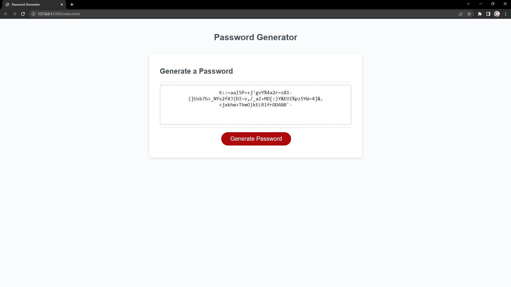

# password-generator

## Project Summary

This project is a program i developed to randomly generate a password between the lengths of 8-128 characters with specified character reuquirements based on the users selected preferences. Some examples of password qualities would be if you wanted lowercase,uppercase,numbers, or special characters in your password.

## Tools Used

* Javascript
* CSS
* HTML

## Images

